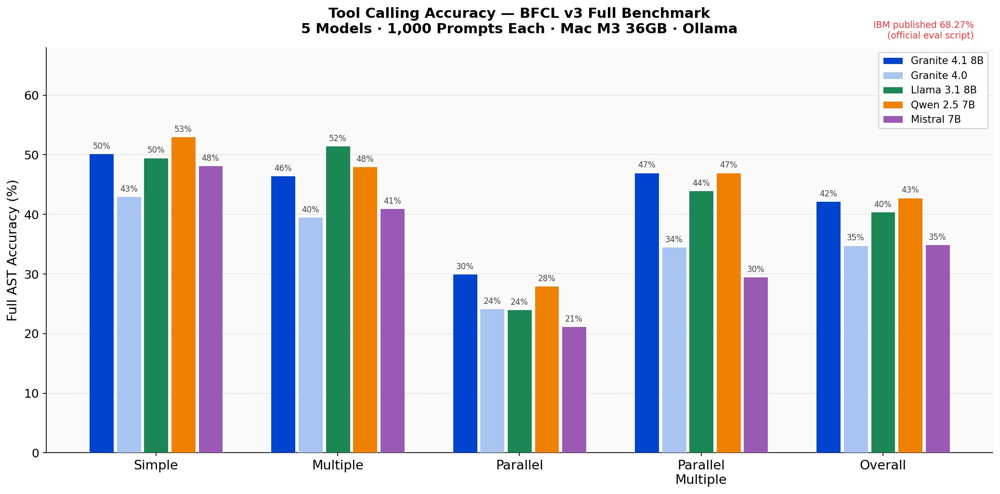
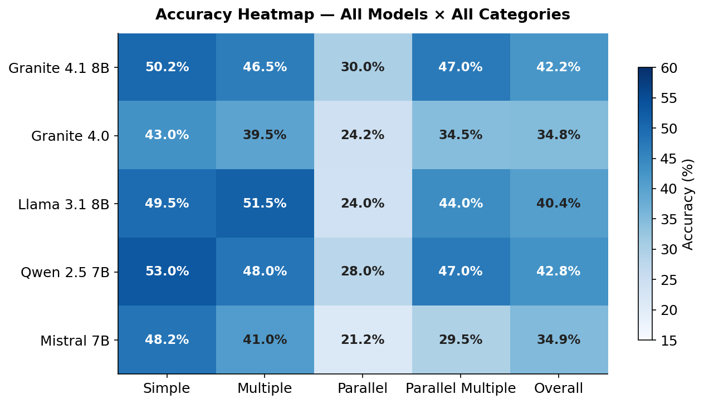
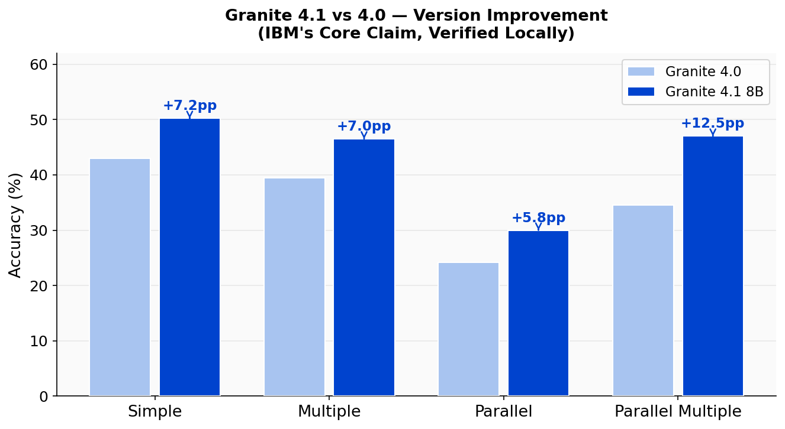
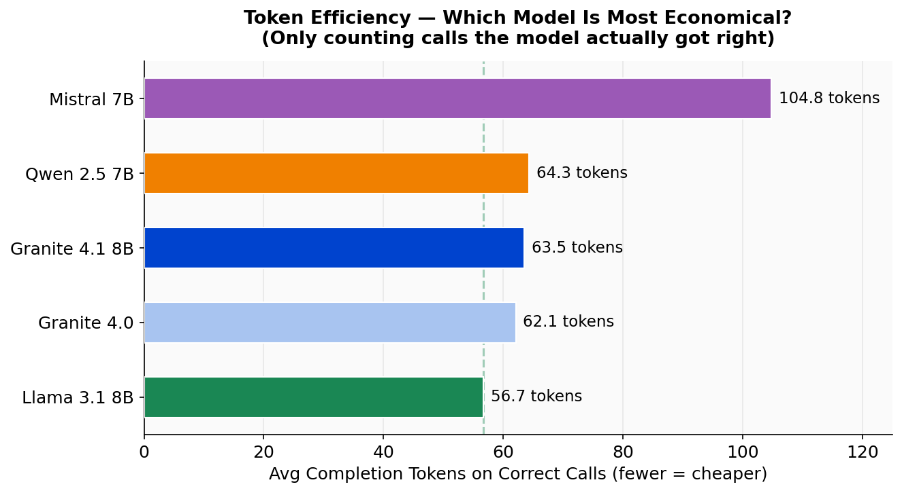
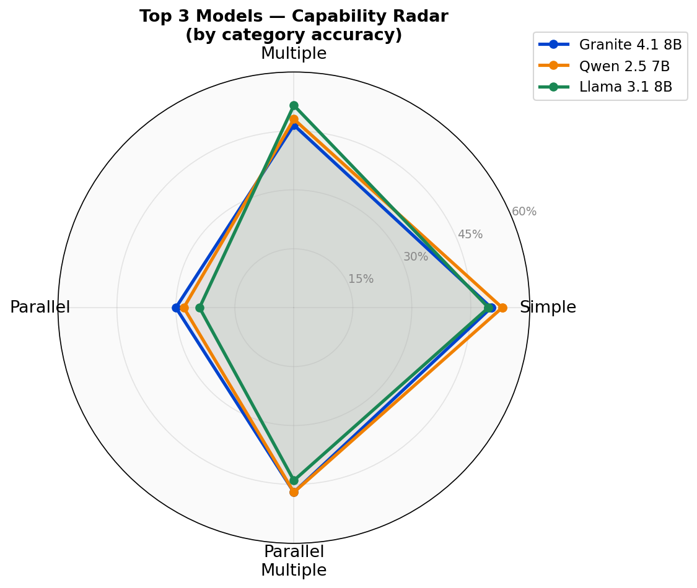
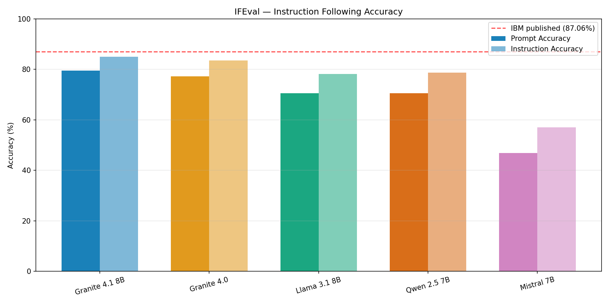

# Benchmarking IBM Granite 4.1 8B — Locally, Honestly, End-to-End


---

IBM says their new 8B model matches a model 4× its size. I ran it myself — on a MacBook M3 — alongside 4 other open-source models. No cloud APIs. No sponsored results. Just real hardware, real benchmarks, and the actual numbers.

This is a three-phase experiment testing IBM's Granite 4.1 8B against Granite 4.0, Llama 3.1 8B, Qwen 2.5 7B, and Mistral 7B across three distinct capability dimensions: tool calling, instruction following, and code generation.

---

## Results at a Glance

**Phase 1 — Tool Calling** (BFCL v3, 1,000 prompts)

| Rank | Model | Accuracy |
|------|-------|----------|
| 🥇 | Qwen 2.5 7B | 42.8% |
| 🥈 | Granite 4.1 8B | 42.2% |
| 🥉 | Llama 3.1 8B | 40.4% |
| 4th | Mistral 7B | 34.9% |
| 5th | Granite 4.0 | 34.8% |

**Phase 2 — Instruction Following** (Google IFEval, 541 prompts)

| Rank | Model | Prompt Accuracy | Instruction Accuracy |
|------|-------|-----------------|----------------------|
| 🥇 | Granite 4.1 8B | **79.7%** | **85.3%** |
| 🥈 | Granite 4.0 | 77.3% | 83.7% |
| 🥉 | Llama 3.1 8B | 70.8% | 78.3% |
| 4th | Qwen 2.5 7B | 70.1% | 78.4% |
| 5th | Mistral 7B | 46.8% | 57.0% |

> **The rankings flip between tasks.** Qwen 2.5 leads on tool calling but drops to 4th on instruction following. Granite 4.0 finishes last on tool calling but 2nd on instruction following. A model's rank is not a fixed property — it depends entirely on what you're asking it to do.

---

## The Setup

| | |
|---|---|
| **Hardware** | MacBook M3, 36 GB unified memory |
| **Runtime** | [Ollama](https://ollama.com) — all inference runs locally, no internet required |
| **Temperature** | 0 for all models, all runs (deterministic outputs) |
| **Scoring** | Fully automated — no human judgment in any result |

**Models tested:**

| Model | Size on Disk | Role |
|-------|-------------|------|
| Granite 4.1 8B | 5.3 GB | IBM's latest — the subject of the experiment |
| Granite 4.0 | 2.1 GB | IBM's previous generation — direct comparison |
| Llama 3.1 8B | 4.9 GB | Meta's flagship 8B — industry baseline |
| Qwen 2.5 7B | 4.7 GB | Alibaba's model — community favourite |
| Mistral 7B | 4.4 GB | Classic open-source baseline |

---

## Phase 1 — Tool Calling (BFCL v3)

📓 [Notebook](phase1_tool_calling.ipynb) · 📝 [Full write-up](blog/phase1_blog.md)

### What is tool calling?

When you ask an AI assistant "what's the weather in Boston?", the model doesn't magically know the answer. Instead, you give it access to a `get_weather(location, unit)` function. The model reads your question and outputs a structured call — your code runs the actual function and returns the result. This pattern is how every real AI agent works: customer service bots, code assistants, research agents, invoice processors. **If a model is unreliable at tool calling, it cannot power a real agent.**

### The benchmark

**BFCL v3** (Berkeley Function Calling Leaderboard v3) — the industry-standard tool-calling benchmark developed at UC Berkeley. This run covered 1,000 prompts across 4 difficulty levels:

| Category | Prompts | Challenge |
|----------|---------|-----------|
| Simple | 400 | Given 1 tool, call it correctly |
| Multiple | 200 | Choose the right tool from 5–10 candidates |
| Parallel | 200 | Fire 2+ tool calls simultaneously |
| Parallel Multiple | 200 | Simultaneously choose + call multiple tools |

### Results





**Per-category breakdown:**

| Model | Simple | Multiple | Parallel | Parallel Multiple | Overall |
|-------|--------|----------|---------|-------------------|---------|
| Granite 4.1 8B | 50.2% | 46.5% | 30.0% | 47.0% | **42.2%** |
| Granite 4.0 | 43.0% | 39.5% | 24.2% | 34.5% | 34.8% |
| Llama 3.1 8B | 47.0% | **51.5%** | 25.5% | 44.5% | 40.4% |
| Qwen 2.5 7B | **53.5%** | 46.5% | 26.5% | **47.5%** | **42.8%** |
| Mistral 7B | 44.5% | 38.0% | 21.2% | 29.5% | 34.9% |

### Granite 4.1 vs 4.0 — the generational leap



Granite 4.1 improved over 4.0 in **every single category**. The biggest gain: +12.5 percentage points on Parallel Multiple — the hardest category.

### Token efficiency



### Capability radar — top 3 models



### A note on IBM's published score

IBM published a BFCL v3 score of **68.27%** for Granite 4.1 8B. Our measurement gives **42.2%**. The gap is explained by dataset distribution: IBM's score uses the official leaderboard weighting (heavily biased toward simple single-function calls). This experiment samples uniformly — 250 prompts per category — including far more parallel and parallel-multiple prompts, which are the hardest. All 5 models faced identical conditions, so relative rankings and category deltas are fully valid.

---

## Phase 2 — Instruction Following (Google IFEval)

📓 [Notebook](phase2_instruction_following.ipynb) · 📝 [Full write-up](blog/phase2_blog.md)

### What is instruction following?

Instruction following is whether a model actually does what you explicitly told it to do: answer in bullet points, write at least 300 words, never use commas, end the response with a specific phrase. This is the backbone of every system prompt, output format requirement, and persona constraint in production. If a model fails here, no amount of clever prompting can fix it.

### The benchmark

**Google IFEval** (NeurIPS 2023) — 541 prompts, each containing 1–3 explicit instructions that can be verified programmatically. No human judgment required. Two metrics:

- **Prompt accuracy** — the entire prompt counted as pass only if all instructions are satisfied
- **Instruction accuracy** — each individual instruction counted separately (more forgiving)

| Instruction Type | What's Checked | Example |
|-----------------|----------------|---------|
| language | Language of response | "Your entire response must be in French" |
| detectable_format | Formatting structure | "Include exactly 3 highlighted sections" |
| detectable_content | Content presence | "End with a postscript starting with P.S." |
| startend | Response framing | "Start your response with 'Certainly'" |
| punctuation | Punctuation rules | "Do not use any commas" |
| change_case | Case formatting | "Write in all capital letters" |
| keywords | Keyword frequency | "Use the word 'algorithm' at least 5 times" |
| length_constraints | Length targets | "Write at least 300 words" |
| combination | Multiple constraints | Any combination of the above |

### Results



**Overall accuracy:**

| Model | Prompt Accuracy | Instruction Accuracy | Avg Tokens | Median Latency |
|-------|-----------------|----------------------|------------|----------------|
| 🥇 Granite 4.1 8B | **79.7%** | **85.3%** | 299 | 9,531ms |
| 🥈 Granite 4.0 | 77.3% | 83.7% | 277 | 4,009ms |
| 🥉 Llama 3.1 8B | 70.8% | 78.3% | 299 | 10,611ms |
| Qwen 2.5 7B | 70.1% | 78.4% | 271 | 8,022ms |
| Mistral 7B | 46.8% | 57.0% | 345 | 11,399ms |

**Accuracy by instruction category:**

| Category | Granite 4.1 | Granite 4.0 | Llama 3.1 | Qwen 2.5 | Mistral |
|----------|-------------|-------------|-----------|----------|---------|
| language | **100.0%** | 93.5% | 90.3% | **100.0%** | 74.2% |
| detectable_content | **96.2%** | 94.3% | 82.4% | 90.6% | 83.0% |
| detectable_format | **96.1%** | 94.9% | 82.1% | 87.2% | 75.8% |
| startend | 95.5% | **97.0%** | 90.9% | 88.1% | 69.7% |
| punctuation | 90.8% | 92.4% | 90.9% | **93.9%** | **9.1%** |
| change_case | 86.2% | **88.8%** | 77.3% | 73.0% | 53.4% |
| keywords | **84.5%** | 74.8% | 77.9% | 75.8% | 69.3% |
| length_constraints | **73.0%** | 71.3% | 68.8% | 62.9% | 45.1% |
| combination | 70.3% | 60.0% | 66.2% | **70.8%** | 18.5% |

> **Mistral scored 9.1% on punctuation instructions.** When asked not to use commas, Mistral uses commas almost every time. This is not a benchmarking quirk — it reveals a fundamental gap in how the model was fine-tuned for constraint following.

### A note on IBM's published score

IBM published **87.06%** instruction-level accuracy for Granite 4.1 8B. Our measurement gives **85.3%** — a gap of only 1.76 percentage points, which is essentially a reproduction of IBM's result. The small gap is explained by the 1,024-token output cap applied here to prevent runaway generation on prompts that ask for very long repetitive responses. IBM ran without a cap.

---

## Cross-Phase Comparison

| Model | Tool Calling | IFEval Prompt Acc | IFEval Instr Acc |
|-------|-------------|-------------------|------------------|
| Granite 4.1 8B | 42.2% | **79.7%** | **85.3%** |
| Granite 4.0 | 34.8% | 77.3% | 83.7% |
| Llama 3.1 8B | 40.4% | 70.8% | 78.3% |
| Qwen 2.5 7B | **42.8%** | 70.1% | 78.4% |
| Mistral 7B | 34.9% | 46.8% | 57.0% |

**Granite 4.1 is the only model in the top two on both dimensions.** Granite 4.0, surprisingly, is a strong instruction-follower despite weak tool-calling — IBM's training clearly prioritised compliance from early on. Qwen 2.5 leads on tool calling but falls to 4th on instruction following. Mistral trails on both.

---

## Phase 3 — Code Generation (Coming Soon)

| Benchmark | Dataset | Status |
|-----------|---------|--------|
| HumanEval (pass@1) | 164 Python problems | ⏳ In progress |

Same 5 models. Same local hardware. Same approach. Results will appear in `phase3_code_generation.ipynb` and `blog/phase3_blog.md`.

Star or watch this repo to get notified when Phase 3 lands.

---

## Run It Yourself

Everything is reproducible on consumer hardware. If you have a Mac with 16 GB+ RAM and Ollama installed, you can run the full experiment.

### 1. Install Ollama and pull models

Download Ollama from [ollama.com](https://ollama.com), then pull the five models (~20 GB total, one-time):

```bash
ollama pull granite4.1:8b
ollama pull granite4:latest
ollama pull llama3.1:8b
ollama pull qwen2.5:7b
ollama pull mistral:7b
```

### 2. Clone and install

```bash
git clone https://github.com/Abivarma/Granite4-1.git
cd Granite4-1
python3.11 -m venv .venv
source .venv/bin/activate
pip install -r requirements.txt
```

### 3. Run Phase 1 (Tool Calling)

```bash
jupyter lab phase1_tool_calling.ipynb
```

Run all cells. Results cache to `results/<model>/` as individual JSON files — if the run is interrupted, re-running skips already-completed samples.

### 4. Run Phase 2 (Instruction Following)

```bash
jupyter lab phase2_instruction_following.ipynb
```

Results cache to `results_ifeval/<model>/`.

### 5. Run tests

```bash
pytest
```

**Expected runtime:** 2–4 hours per phase on M3 hardware. The caching means you can safely stop and resume at any point.

---

## Project Structure

```
Granite4-1/
├── phase1_tool_calling.ipynb          # Phase 1 benchmark — tool calling
├── phase2_instruction_following.ipynb # Phase 2 benchmark — instruction following
├── config.py                          # Model list, paths, and constants
├── requirements.txt                   # Python dependencies
│
├── data/                              # Dataset loaders (BFCL v3, IFEval)
├── inference/                         # Ollama inference runners with caching and timeouts
├── evaluation/                        # Accuracy evaluators (AST matcher, IFEval verifiers)
├── analysis/                          # Chart generation and summary reporting
├── tests/                             # Unit tests for all modules
│
├── blog/                              # Charts and detailed write-ups
│   ├── phase1_blog.md                 # Full Phase 1 write-up
│   ├── phase2_blog.md                 # Full Phase 2 write-up
│   └── chart*.png                     # All Phase 1 charts
│
└── results/                           # Summary charts (PNG)
    └── results_ifeval/                # Phase 2 summary chart
```

Raw per-prompt JSON results (~31 MB, 7,700+ files) are not committed — they reproduce automatically when you run the notebooks.

---

## Methodology

1. **Temperature 0** — all inference is deterministic; re-running produces the same outputs
2. **BFCL evaluation** uses lenient AST matching ([evaluation/ast_matcher.py](evaluation/ast_matcher.py)) — minor type coercions (e.g. int vs float, quoted numbers) are accepted; function names and required parameters must be exact
3. **IFEval evaluation** uses the official Google IFEval instruction verifier classes ([evaluation/ifeval_instructions.py](evaluation/ifeval_instructions.py)) — the same verifiers published with the NeurIPS 2023 paper
4. **IFEval output cap**: 1,024 tokens max per response + 120-second timeout, applied uniformly to all models. Responses cut short by the cap fail any instruction that required more content (slightly deflates all scores vs IBM's uncapped run)
5. **BFCL dataset distribution**: 250 prompts per category (uniform). IBM's published score uses the leaderboard production weighting — heavily biased toward simple single-call prompts — explaining the gap between our 42.2% and IBM's 68.27%
6. All raw per-prompt results are reproducible by running the notebooks from scratch

---

## License

MIT — free to use, modify, and distribute. See [LICENSE](LICENSE) for details.
